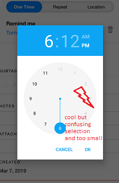

# Contextual Inquiry and Analysis
## Device/ App/ Website Description
Any.do mobile app is an application that is performed on mobile devices that used for reminder and to-do list in your own mobile phone.
In this tested version (free), user will be performing such tasks for example : adding items, editing items, and removing items. 
## Instruction Script
(These instructions are for the user's tomorrow plans)
1. Opening app and login
2. Add reminder for "Makan Apel"
3. Add reminder for "Maen PUBG" at 19.00
4. Add reminder for "Angkat beban" at 16.00
5. List all of the user's tomorrow plans and set reminder based on the time.
6. Add plans for "Kerja Kelompok" at 14.00-17.00 , just received the invitation recently, so the user must change the plans at current time.
7. Add plans for "Belajar" at 19.00-21.00, the user must delete the "Maen PUBG" plans. If there is any plans at current time, it's up for the user whether the user want to change or delete it.
## User Description
- 19 years old
- Currently studying at Marine Engineering ITS, 6th semester.
## Transcript
```text
I = Interviewer (Me)
X = Interviewee

---Pre---
1.  I : Apa jenis HP anda sekarang? (Android / iPhone / conventional)
2.  X : Sekarang pake Android.
3.  I : Apa keperluan anda menggunakan HP sehari-hari?
4.  X : komunikasi general, liat youtube, kadang-kadang maen game.
5.  I : Seberapa sering anda menggunakan HP?
6.  X : kurang lebih 10 jam sehari.
7.  I : Apakah anda sering lupa melakukan suatu pekerjaan?
8.  X : Sering lupa kalo nggak dicatet.
9.  I : Apa yang anda gunakan sebagai pengingat kegiatan sehari-hari?
10. X : Ya diingat ingat aja, dikasih prioritas mengingat.
11. I : Pernahkah menggunakan aplikasi reminder kegiatan?
12. X : Tidak pernah.
13. I : Adakah sesuatu/kebutuhan secara spesifik jika anda memilih suatu reminder?
14. X : Cukup pop-up notification aja sih.

---Main---
15. X : Ini aplikasi apa?
16. I : Aplikasi buat reminder, nanti tugasmu cuma nambahin reminder aja sesuai instruksi
(00:00:01 Membuka Aplikasi)
17. X : (Melihat halaman awal aplikasi) Start like a pro, hmm. Yang mana ini.. Start 7 Days free trial bukan?
18. I : Ndak usah, kita pakai yang free saja.
19. X : Oh ini, skip. 
(00:00:30 berhasil masuk ke halaman utama)
20. I : Coba add salah satu kegiatan.
21. X : Ok, misalnya nih today, mau 'buy' ini, ini jamnya gimana (memilih jam), oh bisa.
(00:00:52 Berhasil menambahkan 'Buy')
22. X : Loh kok dicoret. (00:00:53 Tidak sengaja menekan bullet yang mengakibatkan 'Buy' selesai dilakukan)
23. I : Sekarang coba add reminder makan apel hari ini.
24. X : Ok, jadi aku nyari makan.. (00:01:26 menambahkan 'get')
25. X : Tapi cuma tulisan 'get' doang... (membuka detail 'get'), o ada tagnya, o bisa diedit.
(00:01:47) berhasil menambahkan 'Get makan apel'
26. I : Ok, coba kamu membuat kegiatan untuk besok, yang pertama makan apel, tapi nggak ada jamnya. cukup sebatas reminder aja.
27. X : Ok bentar... Sudah
(00:02:16) berhasil menambahkan 'makan apel'
28. I : Selanjutnya coba buat pengingat 'Maen pubg' besok jam 19.00
29. X : Ok, add maen pubg, jam 19.. dimana ya (mencari jam 19)
(00:03:43) berhasil menambahkan 'maen pubg'
30. I : Buat pengingat latihan beban pada pukul 15.00 besok.
31. X : Angkat beban.. jam 15 (sambil membuat). Sudah.
(00:04:12) berhasil menambahkan 'angkat beban' 
32. I : Selanjutnya coba buat rencana kegiatanmu besok pagi, misal dari bangun tidur sampe tidur malem. Tapi tidak usah terlalu detail.
33. X : Ok, bangun pagi, jam 6 am. (sambil membuat,(00:04:40) membuat 'bangun pagi' tanpa jam. Kemudian menambahkan jam namun sore. Menyadari bahwa reminder set untuk 'today')
(00:05:21 berhasil membuat 'bangun pagi')
34. I : Ok lanjut.
35. X : Mandi deh. Tapi ini agak susahnya di bagian ganti jamnya, karena buat nambah reminder aja butuh banyak pencetan. Terpisah aja tanggal sama waktunya si. ((00:05:37) sambil membuat 'mandi' namun salah jam)
36. I : Kira-kira tulisannya terlalu kecil gak?
37. X : Ya, ini kecil, tidak bisa dibesarin. Tergantung Hp sama jari tangan orangnya si.
38. X : ((00:06:31) jam menjadi p.m., sambil mengganti jam) A.M nya kok nggak bisa dipencet?
39. I : Bisa si harusnya
40. X : (sewaktu edit jam, aplikasi merefer ke 'today') Oh kok today, coba kalau aku pindahin... nah sudah bisa, set Mandi.
(00:06:35) set Mandi
41. I : Ok terus kita tambah lagi untuk besok ada kelas apa saja.
42. X : Besok kuliah apa ya, aku lupa, soalnya hampir sama semua topiknya.
43. X : (Sambil menulis kelas , ngobrol hpnya apa, (00:07:18) Tidak sengaja hpnya dimiringkan). Wuih langsung ilang, hpnya miring langsung ilang kelasnya... Ok sudah buat baru lagi.
(00:07:39) berhasil menambahkan 'kelas 1'
44. I : Ok sip, selanjutnya apa..
45. X : Sholat jumat siangnya. Remind me jam 11.40.
(00:08:01) berhasil menambahkan 'Sholat Jumat'
46. I : Terus kelas apalagi siangnya?
47. X : Selanjutnya reparasi kapal jam setengah dua. Nah udah.
(00:08:21) berhasil menambahkan 'Kelas 2'
48. X : Trus ini nanti kalo reminding nya gimana? Notifikasinya pop-up apa alarm?
49. I : Defaultnya si pop-up.
50. X : Lebih bagus kalo nanti ada widget di atas gitu buat tau upcoming,
51. I : Iya aplikasinya sudah ada fitur itu di hpku dulu.
52. X : Kok gaada?
53. I : Ketutup mungkin atau kepencet tadi.
54. I : Jadi lanjut, ternyata kamu besok ada kerja kelompok habis kuliah siang sampai mahrib. Jadi kamu harus mengganti remindermu bahwa habis kuliah siang itu, ada kerja kelompok, jadi yang tabrakan itu diganti atau dihapus terserah.
55. X : Yang tabrakan ya besok, oo apasih? (sambil mencari, (00:09:76) menemukan), angkat beban tuh tabrakan, jadi langsung diubah aja ya berarti ya. Terus jadwalnya diubah jadi 3.30 ya.
56. I : Ya.
57. X : Pemilihan jamnya aduh, ribet sih... Trus save.
(00:10:19) berhasil ubah jadwal 'Kerja Kelompok'
58. I : Susah nggak kalau cari jadwal yang tabrakan kayak gini? Misal, siang ini kamu mau ngapain aja si.
59. X : Masalahnya, dia ini susunanya nggak bisa urut sesuai jam gitu.
60. I : Jadi harus satu-satu gitu carinya?
61. X : Jadi satu-satu gini kan agak bingung. Trus kayakny tulisan jamnya juga kekecilan.
62. I : Apalagi misal?
63. X : Trus bisa nggak ini diulang-ulang (concurrent), jadi 1 minggu itu jadwalnya bisa sama gitu.
64. I : Bisa, tapi bayar fitur premium.
65. X : lul, ya gapapa si kalau memang niat gitu.
66. I : Ok jadi lanjut ke instruksi selanjutnya, jadi karena kamu baru mendapat kabar bahwa besok ada kuis, ternyata malem habis mahrib itu harus belajar, dan kamu memutuskan untuk tidak main pubg. Coba ganti remindermu.
67. X : Ok, mana main pubg (sambil mencari)... ok ganti belajar (00:12:25 mengganti menjadi ""belajar"". (A) petik 2 dianggap important uleh X).
68. X : (sambil mengganti, (00:12:35) menemukan tag important) nah ini, nice udah.
(00:12:39) berhasil mengganti belajar
69. I : Ada saran lagi buat aplikasinya?
70. X : Selain waktu sama sorting si apalagi ya... ((00:13:28) menemukan tab kalender) nah kalo ini baru bisa urut coy jadwalnya, nggak kayak di halaman utama, bikin bingung juga si, bagus juga ya bisa konek sama google calendar.
-End of main-
```
## Models and Annotations
### Artifact Model
<p align="center">
  <br>
  <br>
  <br>
  <br>
  <br>
</p>
### Flow Model

### Cultural Model

## Do's and Don't's
###Do
- Change the time selection features in a more communicative way, and easy to use
- Remake the finish selection to a uncolored checkbox. This might give more clarity to user than using just blank circle.
###Don't
- Ambigual meaning of the button on top right. (User see it as a new message)
- Unimportant animations / transitions
- Using to small selection fields